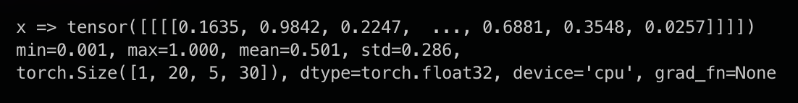

# tdb - Tensor Debugging Library for PyTorch

**tdb** is a lightweight, intuitive Python library designed for efficient debugging and exploration of PyTorch tensors. It streamlines development and improves troubleshooting by offering a straightforward interface for inspecting tensor values and shapes, facilitating a better understanding of operations and data flow in PyTorch.

### Installation:
```bash
pip install git+https://github.com/KonradSzafer/tdb.git
```

### Usage:
```python
from tdb import tdb

x = torch.rand(1, 20, 5, 30)
tdb.print(x, 'x')
```



<!-- ### Example Usage:
 -->

### Configuration Options:
```python
tdb.options['disable'] = False # Set to True to disable all tdb output
tdb.options['print_values_threshold'] = 10 # Determines the maximum number of values to display from the last dimension of a tensor
tdb.options['assignment_symbol'] = '=' # Specifies the symbol used to separate tensor parameters from their values
```
